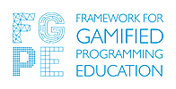

# FGPE AuthorKit API

The API of a toolkit to author gamified activities to support programming learning. This is part of the Erasmus+ Project entitled Framework for Gamified Programming Education (FGPE).

## Requirements

* Node Version Manager [n](https://www.npmjs.com/package/n)
* Docker + Docker Compose
* npm

## Installation

```bash
$ npm install
```

## Configuration

Copy file `.env.example` and name it `.env.dev`

## Start Guide

### Outside Docker containers

- Create .env file `cp .env.example .env` and fill-in existing env variables
- Install dependencies `npm install`
- Start the app `npm run start`

### Inside Docker containers

Just run already prepared bash script:
```bash
$ ./build
```
It will setup the project for you (building the Docker images, starting docker-compose stack).
The NestJS app running in dev mode will be exposed on `http://localhost` (port 80)

For IDE autocompletion to work, run `yarn` on the host machine.

### Working w/ the app

```bash
# Bring up the docker with api, database, ...
$ docker-compose up -d

# development
$ npm run start

# build
$ npm run build

# production mode
$ npm run prod

# fix lint errors
$ npm run lint:fix
```

## Docker build

### Build image

To build a docker image, execute:

```bash
$ ./build.sh
```

## Test

```bash
# unit tests
$ docker exec -it nest npm run test

# e2e tests
$ docker exec -it nest npm run test:e2e

# test coverage
$ docker exec -it nest npm run test:cov
```

## Environment Configuration

`.env.example` contains the configuration keys that must be set in `.env.dev` for development and/or
`.env.prod` for production.

When using the build script, one of these is automatically cloned to `.env`. If you don't use the
build script, please m

## Swagger

To see all available endpoints visit http://localhost/docs

## TypeORM integrated

[TypeORM](http://typeorm.io/) gives the possibility to use next db types:
`mysql`, `postgres`, `mariadb`, `sqlite`, `mongodb` etc. Please look at docs for more details.

We are using `postgres`.


## Acknowledgments

<table cellspacing="0" cellpadding="0" border=0>
<tr border=0>
<td border=0>

This software has been developed as a part of the Framework for Gamified Programming Education project ([https://fgpe.usz.edu.pl/](https://fgpe.usz.edu.pl/)), co-funded by the Erasmus+ Programme of the European Union.

</td>
<td border=0>

 

</td>
</tr>
</table>

## License

[](https://www.gnu.org/licenses/gpl-3.0)
